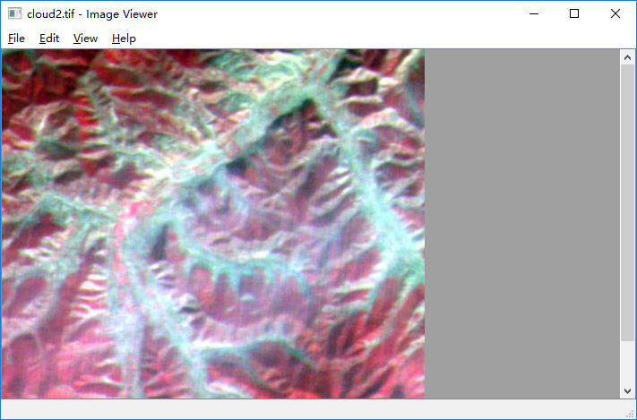

# 0.程序框架构建
掌握Qt、MFC或其他界面框架，构建基本的系统原型，包括视图、菜单、工具栏等界面要素。

## 目录
- [一、开发环境配置](#一开发环境配置)
- [二、示例代码](#二示例代码)
- [三、参考资料](#三参考资料)

## 一、开发环境配置
### 1. VS2017安装

### 2. Qt 安装与配置
#### 2.1. Qt Download
[最新版本Qt5.10.1](http://download.qt.io/archive/qt/5.10/5.10.1/qt-opensource-windows-x86-5.10.1.exe)

当然，你也可以选择其他适合自己的[版本](http://download.qt.io/archive/qt)

#### 2.2. Qt Setup
Qt安装安装步骤参照<https://blog.csdn.net/liang19890820/article/details/53931813#%E9%85%8D%E7%BD%AE-qt-creator>

#### 2.3.Qt Options
Qt使用有2种，一种是QtCreator，一种是VS插件，这两种方式各有优劣。

#### 2.4. Qt Tutorials
[Qt 入门](https://blog.csdn.net/Louis_815/article/details/54286544)

## 二、示例代码
参见Qt Image Viewer Example。
[code download](../src/imageviewer.rar)

                                      示例代码界面图

## 三、参考资料
### 3.1. Qt VS. VS IDE
- QtCreator的优势是轻便、开源免费；
[Set Qt MinGW](https://blog.csdn.net/liang19890820/article/details/49894691)

- VS的优势是效率高，调试方便。具体设置见：
[Set Qt for VS](https://blog.csdn.net/liang19890820/article/details/49874033)

[Set Qt & VS](https://blog.csdn.net/pianzang5201/article/details/79721623)

### 3.2. Compile GDAL & OpenCV in MinGW
#### 3.2.1 Download source code
- MinGW

在安装Qt的时候，已经顺带安装了，MinGW是一个编译器，跨平台

- [CMake](www.cmake.org)

GUI方式生成各类编译器识别的makefile, [下载地址](https://cmake.org/files/v3.11/cmake-3.11.1-win64-x64.zip)

- [OpenCV下载](www.opencv.org)

- [GDAL下载](http://download.osgeo.org/gdal)

### 3.2.2 Environment

设置各类系统变量，参见<https://blog.csdn.net/asklw/article/details/72566428>

### 3.2.3 Compile

- [Compile GDAL With MinGW](http://trac.osgeo.org/gdal/wiki/BuildingWithMinGW)

- [Compile OpenCV With MinGW](https://blog.csdn.net/asklw/article/details/72566428)

---
[Home](../docs/README.md) | [Return](#目录)  | [Next](./D2_RasterIO.md)

